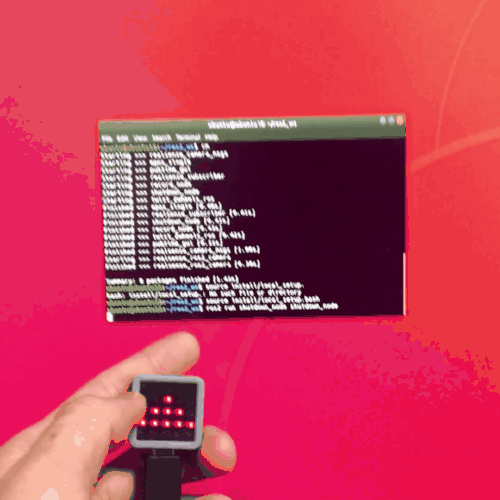

# M5Atom shutdown switch

M5Atom's program as a shutdown switch using ROS2.

### m5atom_shutdown_btn_ros2.ino

- Compile and write to M5AtomMatrix on Arduino ino.

### shutdown_node

1. Copy the folder to `<your ROS2 workspace>/src/`
2. In`<your ROS2 workspace>`, run `$ colcon build`
3. `$ source install/local_setup.bash`
4. `$ ros2 run shutdown_node shutdown_node`

### Pub/Sub Topic

- `/btn_msg` : std_msgs::Bool (Action : 1->Shutdown , 0->No action)

### Example Gif

